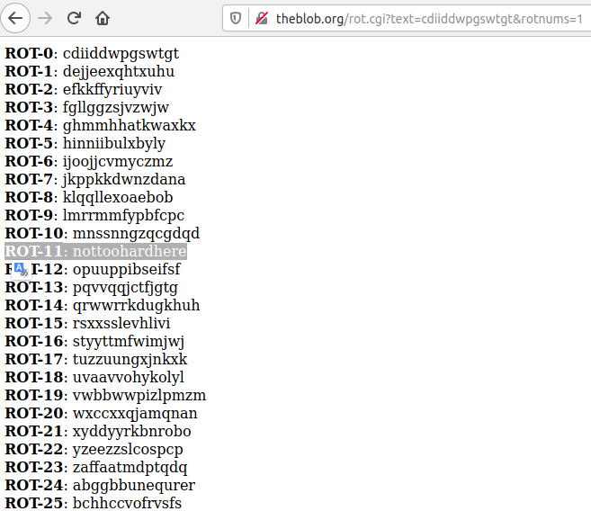

We are looking for files belonging to the user flag00
and redirect the error output to /dev /null

    find / -user flag00 2>/dev/null

And check the contents of the files

    cat /usr/sbin/john /usr/sbin/john

This text is not suitable as a password.  
It is probably encrypted.  
Trying different decoding options and find that the password is encoded in ROT11.  
This can be checked on the website: http://theblob.org/rot.cgi

We see a meaningful word and try it as a password: 
    
    nottoohardhere

token: `x24ti5gi3x0ol2eh4esiuxias`