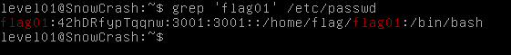
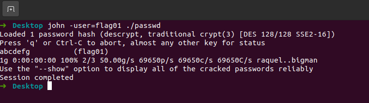

Our home directory is empty. Try find credentials for flag01 in `/etc/passwd` file:

    grep 'flag01' /etc/passwd

We see hashed password for this user. Let's try to crack the password, using `john`.
First, download the `/etc/passwd` on our local machine:

    scp -P 4242 level01@<SnowCrash IP>:/etc/passwd <path in local machine>

Start `john` with downloaded file:

    john -user=flag01 ./passwd

We get password `abcdefg` for flag01

Password for level02: `f2av5il02puano7naaf6adaaf`