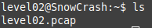
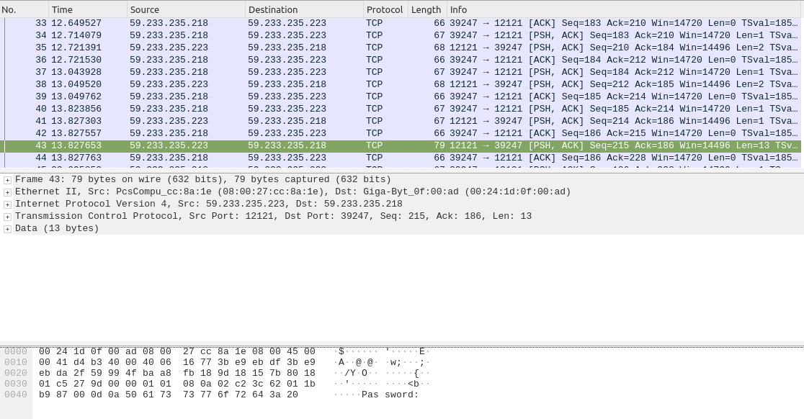
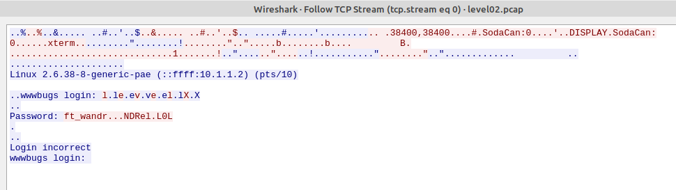
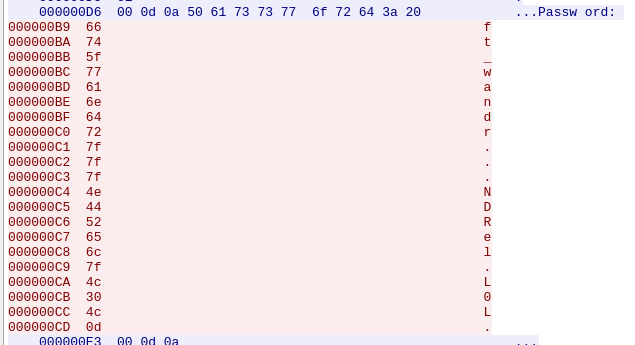

We see the file level02.pcap

Download it using scp:

    scp -P 4242 level02@[ip]:~/level02.pcap .

The PCAP file contains the data of the network packets captured by the Wireshark traffic analyzer.
Give permission to read the file and see what's inside:

    chmod +r level02.pcap 
    wireshark level02.pcap 

We look at the packages and see the word Password in one of them:

Let's look at the TCP stream:

    Right Click -> Follow -> TCP Stream

The password does not fit, so dots replace invisible characters, let's see log in the form of a hex dump:

We see the symbol 7f, which means pressing the DEL key
Also the character 0d, meaning '\r' (carriage ret)

So from `ft_wandr...NDRel.L0L.` we can get `ft_waNDReL0L`

token: `kooda2puivaav1idi4f57q8iq`
