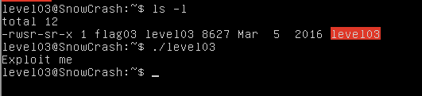

[comment]: <> (test this step!)
In our home directory there is an executable file level03.

We can use `ltrace` to take a look at the functions called in this executable.

    ltrace ./level03

[comment]: <> (output ltrace)

Level03 program launch shell command throw `system()`, using euid and egid of level03.
So, system function start command `/usr/bin/env echo`, at first, shell interpreter will find executable file `echo` in PATH.
`echo` will be execute form first path where it will be find.

Thus, we can create our echo executable (see echo.c in Ressources) in `/tmp` directory, where we launch command `getflag`.

    cd /tmp; gcc echo.c -o echo

We should change PATH variable before launch level03.

    export PATH=/tmp:$PATH
    ./level03

[comment]: <> (output level03)

We get password for level04