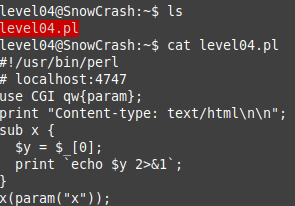
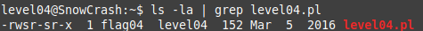
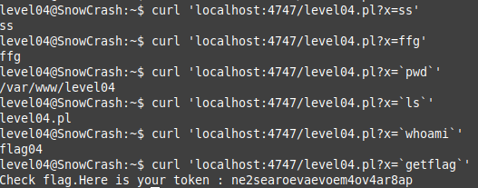

We see a file level04.pl containing a script on PERL:

The string `use CGI qw{param};` means import GCI functions into the script namespace,
it is a standard library for a web server running on a local machine,
as indicated by the comment: `# localhost:4747`

You can also see that the file belongs to the user `flag04`:

We assume that the script should be run on the server, so we make a `curl` request:

    curl 'localhost:4747/level04.pl'

We see that no error occurs, then we will try to transfer the parameter to the script.
As a result, we find that the server can return the token we are looking for if we pass the command `getflag` as a parameter

    curl 'localhost:4747/level04.pl?x=`getflag`'

token: `ne2searoevaevoem4ov4ar8ap`