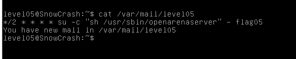
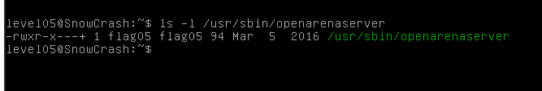
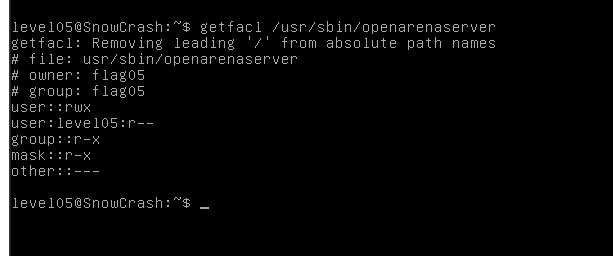
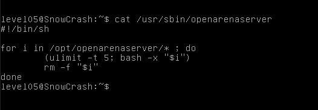
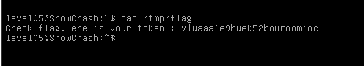

After logging we get message, we have a e-mail in `/var/mail/level05`.

This syntax is used by cron scheduler and it means that command 
`su -c "sh /usr/sbin/openarenaserver" - flag05` will be executed every 2 minutes.

Let's see a file `/usr/sbin/openarenaserver` permissions

    ls -l /usr/sbin/openarenaserver

This file is (obviously) owned by the user flag05, but the '+' indicates that some specials permissions have been set (ACL attribute).
`getfacl /usr/sbin/openarenaserver` displays these permissions, especially the level05 user ones.

According to these permissions, look at the content of the file.

    cat /usr/sbin/openarenaserver

Every two minutes, any file which is present in `/opt/openarenaserver` folder will be executed through bash with the flag05 permissions, then deleted.
This folder allows level05 user to write in, so create a simple script that execute the `getflag` command and redirect the output to a file to get it.
The file must be in another folder, accessible for writing, to not have it deleted after the script execution.

    echo "getflag > /tmp/flag" > /opt/openarenaserver/getflag.sh

Wait a little time and check the `/tmp/flag`

    cat /tmp/flag

We get password for level06:`viuaaale9huek52boumoomioc`