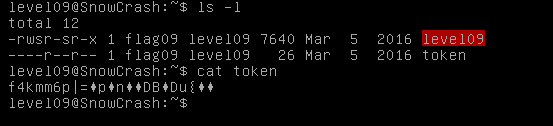
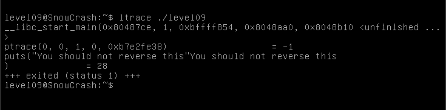
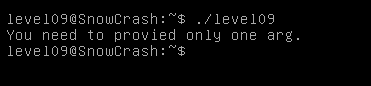
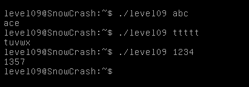

We find in our home an executable file level09 with uid flag09 and a readable `token` file

This string look like a something hashed. Try to execute `ltrace` with level09

`ltrace` output didn't get any help for us. Let's execute level09

This program expects one argument. Give different arguments for it and look at result.

You can notice program encrypt string argument, increasing each letter to it index.
If level09 was used to encrypt string in token file, we can provide our program (decrypt.cpp in Ressources) to reverse it.

    scp -P 4242 level09@<SnowCrash IP>:/etc/passwd <path in local machine>
    g++ decrypt.cpp -o decrypt
    chmod +r token
    ./decrypt token

We get password `f3iji1ju5yuevaus41q1afiuq` for flag09

Password for level10: `s5cAJpM8ev6XHw998pRWG728z`
