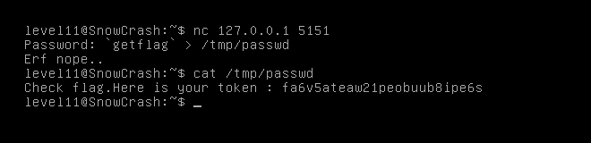

We find in our home a Lua script level11 with uid flag11. Let's learn it.

    #!/usr/bin/env lua
    local socket = require("socket")
    local server = assert(socket.bind("127.0.0.1", 5151))
    
    function hash(pass)
    prog = io.popen("echo "..pass.." | sha1sum", "r")
    data = prog:read("*all")
    prog:close()
    
    data = string.sub(data, 1, 40)
    
    return data
    end
    
    
    while 1 do
    local client = server:accept()
    client:send("Password: ")
    client:settimeout(60)
    local l, err = client:receive()
    if not err then
    print("trying " .. l)
    local h = hash(l)
    
          if h ~= "f05d1d066fb246efe0c6f7d095f909a7a0cf34a0" then
              client:send("Erf nope..\n");
          else
              client:send("Gz you dumb*\n")
          end
    
    end
    
    client:close()
    end

This script accept TCP-connection with 127.0.0.1 at 5151 port.
What will be sent over the connection, script will execute it using echo command and redirect output over pipe to sha1sum.
We can redirect output to file before redirection over pipe
So, Lua script execute with flag11 user permissions, we can inject `getflag` over the connection.

Password for level12: `fa6v5ateaw21peobuub8ipe6s`