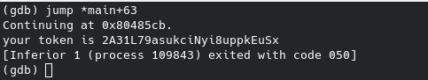

We find in our home executable file level13 with uid flag13. Try execute it.

Output calls us program expect that it will be executed by user with uid 4242.
Let's run `gdb` to look disassembly code.

    gdb -q ./level13

It do comparing after calling `getuid`. Let's put a breakpoint there.

We have two ways now:
1. Jump to instructions if be whether comparing is true. And we will get password for level14

    

2. Change comparing value:
   - Print eax register to see, what program compares

    

    - Compare this value with our uid

      

    - Change eax value and resume the program. We will get password for level14

   

Password for level14: `2A31L79asukciNyi8uppkEuSx`