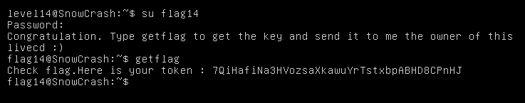

Home directory of level14 user is empty. Let's try to use commands from previously steps to find any useful files.

Nothing! We could trick an executable file with a debugger in previously step (level13).
Let's try some with `getflag`. At first, try launch `ltrace`.

    ltrace getflag

We see that the executable is protected by a call to ptrace. Let's run `gdb` to look disassembly code.

    gdb -q getflag

Program test value in eax (main+72) after calling `ptrace`. Took a look there:

We can therefore change the value in the register to 0, to bypass the error when calling ptrace:

The call to `ptrace` is bypassed. However, we aren't still identified as flag14.
If we look again at the disassembly code, we see that a check is made during a call to `getuid` (main+452).
We should repeat the first steps to bypass ptrace, and continue:

Eax contains value of our local user's uid (or level14 if you debug in VM).
we should change the value in the register to flag14 uid:

We get password `7QiHafiNa3HVozsaXkawuYrTstxbpABHD8CPnHJ` for flag14

